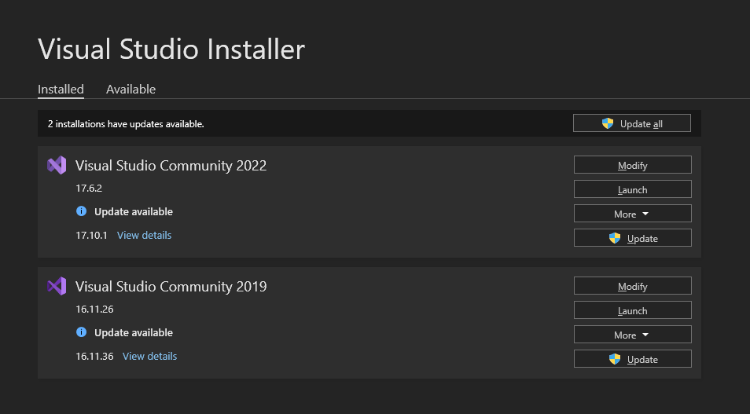
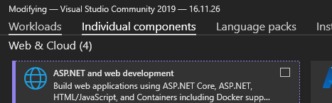
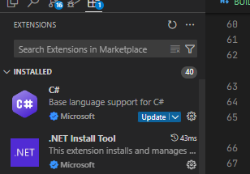

# Building Equinox Engine

* Here is an in-depth guide for compiling Equinox Engine.

## Installation

* *To build Equinox Engine, you must have the follow dependencies/applications first that will be used for your development:*
	+ [``Haxe``](https://haxe.org/download/version/4.2.5/) [``4.2.5``] - Specifically, use version [``4.2.5``](https://haxe.org/download/version/4.2.5/).
	+ [``Visual Studio``](https://visualstudio.microsoft.com/) [``VS2019/VS2022``] - You can either download **Visual Studio 2019** or **Visual Studio 2022**. This will be used for compiling.
	+ [``Git``](https://www.git-scm.com/downloads) [``Latest``] - Used for development and will be used for getting packages and installing the repository of the engine.
		- **OPTIONAL [RECOMMENDED]**: [``lazygit``](https://github.com/jesseduffield/lazygit) - Acts as a simple UI interface for ``Git``, makes handling git repositories easier.
	+ [``Visual Studio Code``](https://code.visualstudio.com/) [``Latest``] - The editor that will be used for writing code.
* After installing all of the needed stuff, you will now need to clone the repository with [``Git``](https://www.git-scm.com/downloads). Open up your ``cmd`` or ``powershell`` and type in the following command:

```bash
$ mkdir EquinoxEngine # Make a folder for the repository.
$ cd EquinoxEngine # Change the directory to that folder.
$ git clone --depth=1 --recursive "https://github.com/Equinoxtic/EquinoxEngine.git" . # Use git clone in the current folder.

# "git clone" is a common command used for cloning repositories from GitHub or GitLab.

# By passing "--depth=1" as a flag, we are creating a shallow clone. Which means you are only going to be cloning on the latest commit. [You may remove this if you want to cloen with all the latest commits]

# By passing "--recursive" as a flag, you are also including all of the defined submodules of the repository when cloning.
```

* Don't close your ``cmd`` or ``powershell``. Keep it open until we are ready to compile the game.

## Setup - Visual Studio

* We will need to set up ``Visual Studio`` first. Open the ``Visual Studio Installer``, you will be then lead to an interface where you can see your installations. If none are installed, you can click on the *``"Available"``* tab from the *top-right* corrner.

<center>

</center>

* It can be either Visual Studio 2019/2022. Now you will need to click on the button named *``"Modify"``*.
* From there, you will see an interface where you can install "Components". We will only need to install two of these components. You will now need to click on *``"Individual Components"``*

<center>

</center>

* From there, you will be lead to another interface where you can install standalone components. Now you will need to search and install the following:

```c
/*
* ALl of this is a total of 4GB. So it's advised to free a little bit of space in your hard drive.
*/

MSVC v142 - VS 2019 C++ x64/x86 build tools (Latest)

Windows 10 SDK (10.0.17763.0) // For those who are on Visual Studio 2019.

Windows 10 SDK (10.0.18362.0) // For those who are on Visual Studio 2022.
```

* After installing, there should be a button in the *bottom-right* corner called *``"Modify"``*, click on it and it will start installing the stuff needed for compiling. You're pretty much done for the first part of the setup when it's done installing.

## Setup - Haxelib

* You can proceed to installing the ``haxelib`` packages needed for compiling. Firstly, open your ``cmd`` or ``powershell`` (if you closed it) then type in the following:

```bash
> cd EquinoxEngine # Only do this when you closed ``cmd`` or ``powershell`` prior to this installation.

> .\scripts\setup-windows.bat # For Windows Users.

> ./scripts/setup-unix.sh # For Linux Users.

# After execution of these scripts, you will begin installing the packages required for compiling the game. If a prompt appears in the installation, asking you if you want to "Switch version of [package]? [y/n/a]" then type in "n" for no.
```

* Do not close ``cmd`` or ``powershell`` as there is only one more step after installing the packages, and that is compiling the game.

## Compiling

* To compile the game, it is simple, really. After compiling the game, you should be able to now edit code with ``Visual Studio Code``, which we will setup later, after compilation. To compile, type in the following command in your ``cmd`` or ``powershell``:

```bash
$ lime test windows # [Default command, run this.]

$ lime test windows -Ddebug # For debugging, it's not necessary to run but it may come useful for you when in development.

$ lime build windows # Only build but don't run the executable.
```

* Compiling the game may take a little while, the time varies from person to person with their PC. But you're pretty much done after compilation finishes and you get the game up and running.

## Visual Studio Code - Setup for Haxe Development

* This isn't mandatory, but it is recommended that you install extensions for ``VSCode`` that will help you develop with ``Haxe`` projects.

* In your ``cmd`` or ``powershel``, type in ``cd EquinoxEngine`` and then type in ``code .``, this opens ``Visual Studio Code``. After that you will want to press ``CTRL+SHIFT+X``. This opens up your installed extensions.

<center>

</center>

* In the search bar, you may search and install the following extensions:

```md
* Haxe - Haxe Foundation [nadako.vshaxe]
* Haxe blocks - Alexander Nanberg [jeremyfa.haxe-blocks]
* Lime - OpenFL [openfl.lime-vscode-extension]
* HXCPP Debugger - Haxe Foundation [vshaxe.hxcpp-debugger]
* Codedox - wiggin77 [wiggin77.codedox]
```

* After installing all extensions, you can now press ``CTRL+SHIFT+E`` on your keyboard. This leads you back to the Engine's source files.

## You're pretty much done now! :D

* You're all mostly set up by this point. By now you can read the ``Haxe`` and ``HaxeFlixel`` documentation for your modding needs. Links will be provided for the needed resources.

	+ [**``Psych Engine • Lua Script API``**](https://github.com/ShadowMario/FNF-PsychEngine/wiki/Lua-Script-API) - For those who mainly code and have experience with making lua scripts.
	+ [**``Haxe Documentation • v4.2.5``**](https://api.haxe.org/v/4.2.5/haxe/index.html) - For those who are curious to learn ``Haxe``.
	+ [**``HaxeFlixel • API/Documentation``**](https://api.haxeflixel.com/flixel) - For those who are interested in learning how to mod the source code.
